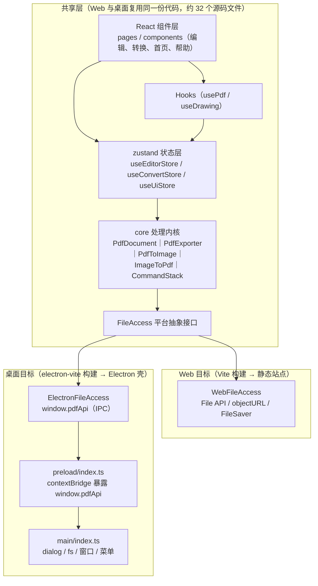
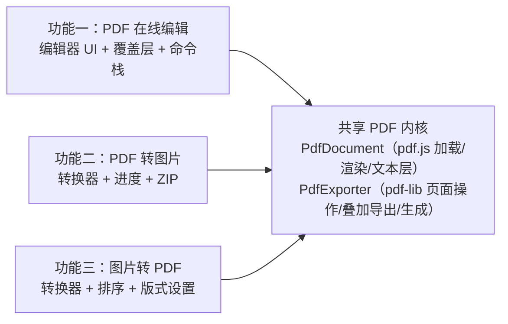
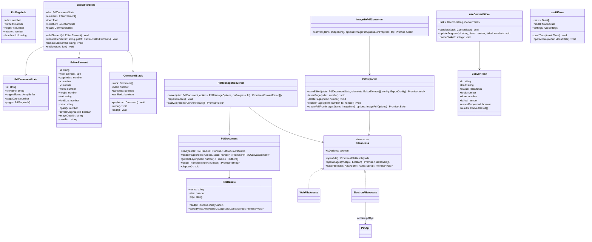
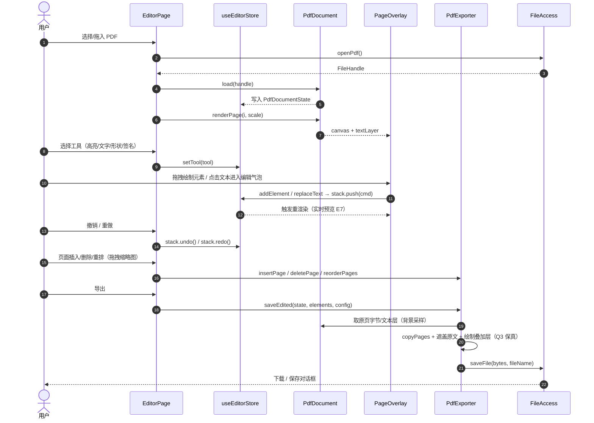
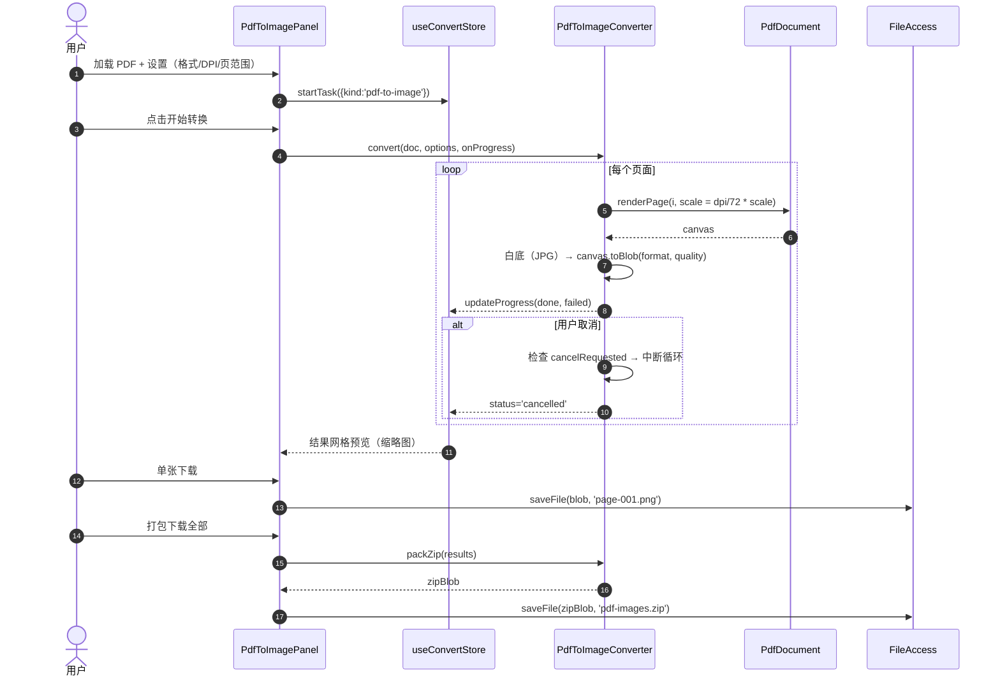
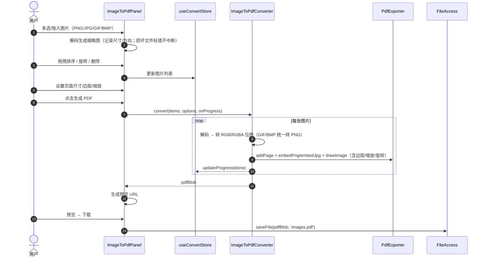
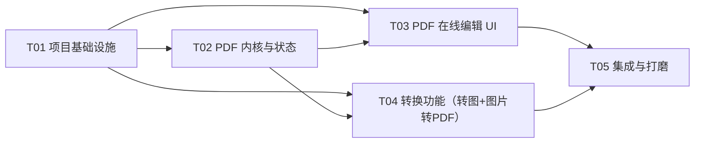

# PDF 编辑器 — 系统架构设计（ARCHITECTURE.md）

| 项目信息 | 内容 |
| --- | --- |
| 文档版本 | v1.0 |
| 编写人 | 高见远（架构师） |
| 编写日期 | 2026-02-10 |
| 上游输入 | docs/PRD.md v1.0 |
| 语言 | 简体中文 |
| 交付物 | 本文件、docs/TASKS.json、docs/class-diagram.mermaid、docs/sequence-diagram.mermaid |

---

## 0. 关键技术决策（对应 PRD 待确认问题 Q1–Q3）

### 决策一（Q1）：桌面端外壳选用 **Electron**（弃用 Tauri）

| 评估维度 | Electron | Tauri | 结论 |
| --- | --- | --- | --- |
| Web 代码复用度 | 渲染进程即 Chromium，Web 端代码 100% 复用 | 复用 Web 前端，但系统 WebView 存在差异 | Electron 胜 |
| pdf.js / pdf-lib 兼容性 | 与 Chrome 完全一致，canvas/text-layer 渲染零差异 | Windows WebView2 虽为 Chromium 内核，但版本跟随系统、存在历史兼容坑 | Electron 胜 |
| Windows 打包 | electron-builder 成熟（NSIS/portable/msi） | 需 Rust 工具链 + NSIS/MSI 配置，签名更繁琐 | Electron 胜 |
| 开发者维护成本 | 仅需 Node/npm（已有 Node v22.22.2） | 需额外安装 Rust 工具链 | Electron 胜 |
| 安装包体积/内存 | 约 80–120MB / 内存较高 | 约 5–15MB / 内存低 | Tauri 胜 |

**结论**：本产品「本地优先、功能完整、双端复用同一套 Web 代码」是最高优先级，安装包体积不是核心痛点；且开发环境已具备 Node/npm 而无 Rust。**采用 Electron**，架构上把 Electron 壳（`electron/` 目录）与 Web 代码彻底隔离，**Web 端源码零改动复用为桌面端**；仅文件接入方式通过 `FileAccess` 平台抽象切换。

**Windows 打包注意点（写入实现约定）**：
1. electron-builder 目标：`nsis`（安装版）+ `portable`（免安装单文件）。
2. 下载 Electron 二进制在部分网络环境较慢，可配置镜像：`ELECTRON_MIRROR=https://npmmirror.com/mirrors/electron/`。
3. 生产包建议启用代码签名（非 P0，可后续），未签名包可能触发 SmartScreen/杀软误报。
4. asar 打包默认开启；`asarUnpack` 需包含 pdf.js worker 等二进制资源（如有）。
5. 桌面端断网验证是验收项（AC-G3），必须确保所有依赖本地打包、无运行时 CDN。

### 决策二（Q2）：文本编辑采用「渲染层编辑 + 导出叠加」方案（确认降级方案）

真正的矢量文本编辑（改写 PDF 内容流、保留字体子集与排版）在开源生态中没有可靠方案，技术难度极高、风险不可控。**确认采用**：

- **编辑层**：pdf.js 渲染页面为 canvas（视觉）+ text-layer（文本命中/选择）；所有批注、高亮、形状、图片、签名、覆盖文本作为**覆盖层 DOM/SVG 元素**，叠加在 canvas 之上，所见即所得（E7）。
- **导出层**：pdf-lib 以 `copyPages` 复制原 PDF（**原文文本层完整保留**），再按页面坐标绘制叠加元素（遮盖原文 + 新文本 + 高亮/图形/图片）。

### 决策三（Q3）：导出后文本**保持可搜索/可选中**（采纳建议默认）

- **未编辑文本**：`copyPages` 原样复制内容流 → 仍是真实矢量文本，可搜索、可选中（保真度最高）。
- **被替换文本区域**：先用与页面背景一致的颜色矩形遮盖原文，再以嵌入字体绘制新文本 → 新文本也是真实文本（拉丁字符可直接搜索；中文依赖捆绑的 Noto Sans SC 字体子集）。
- **新增批注文本**：作为文本注释或绘制文本对象导出，同样可选中。

> 该方案使「导出保真」在工程可行性与 Q3 之间取得最佳平衡；详见 §4.2 导出保真策略。

---

## 1. 总体架构

### 1.1 分层架构图



**关键原则**：
- 共享层（core / store / hooks / components / pages）**不 import 任何 electron 相关模块**，只在运行时通过 `FileAccess` 抽象访问文件。
- 平台差异（Web 的 File API vs 桌面的文件对话框 + fs 读写）被收敛到 `FileAccess` 一个接口，UI 层无感知。
- 所有处理库（pdf.js、pdf-lib、JSZip）在浏览器本地运行，**零上传、零 CDN 运行时依赖**（G3 / AC-G2）。

### 1.2 三大功能模块与共享内核的关系



三大功能**只共享内核接口，互不依赖**，可独立开发（T03 与 T04 并行）、最终在 App 路由层集成。

---

## 2. 技术栈与版本清单

### 2.1 运行时依赖（dependencies）

| 包 | 版本 | 用途 | 备注 |
| --- | --- | --- | --- |
| react | ^18.3.1 | UI 框架 | React 18 稳定，生态兼容最好 |
| react-dom | ^18.3.1 | DOM 渲染 | |
| react-router-dom | ^6.28.0 | 页面路由（首页/编辑/转换/帮助） | |
| zustand | ^5.0.1 | 轻量全局状态管理 | 相比 Redux 更轻，适合本规模 |
| pdfjs-dist | ^4.10.38 | PDF 解析/渲染 canvas/文本层（编辑渲染 + 转图） | worker 本地打包，见 §7 共享约定 |
| pdf-lib | ^1.17.1 | 页面复制/插入/删除/重排、叠加导出、图片转 PDF、字体嵌入 | **替代 jsPDF（见下）** |
| jszip | ^3.10.1 | PDF 转图片批量 ZIP 打包 | |
| file-saver | ^2.0.5 | Web 端触发文件下载 | 桌面端走 IPC 保存 |
| react-dropzone | ^14.3.5 | 拖拽/多选上传（Web + 桌面渲染层） | |
| @dnd-kit/core | ^6.3.1 | 拖拽排序基础（页面缩略图、图片列表） | 比 react-dnd 轻量 |
| @dnd-kit/sortable | ^8.0.0 | 可排序列表 | |
| lucide-react | ^0.460.0 | 极简线性图标集 | 契合极简专业 UI，免自绘 SVG |

**关于 MUI 的评估（结论：不使用）**：
1. 用户偏好「极简专业 UI」，MUI 的 Material 视觉语言与自研极简风格冲突，定制成本反而更高；
2. 本产品 UI 以画布/工具栏/面板为主，自定义程度高，MUI 预置表单组件收益低；
3. 移除 MUI 可减少约 300KB+ 打包体积，提升首屏与离线体验。
→ **采用 Tailwind CSS 自研轻量组件库**（Button/Input/Modal/Toast 等封装在 `components/common/ui.tsx`，约 200 行）。

**关于 jsPDF 的评估（结论：不使用）**：
- 图片转 PDF：pdf-lib 的 `embedJpg/embedPng + addPage + drawImage` 已完全覆盖（页面尺寸/边距/缩放/旋转），且 API 更贴近 PDF 坐标模型；
- 编辑导出：pdf-lib `copyPages` 保留原文，jsPDF 无法做到同等保真；
- 省去一个 300KB+ 依赖，减少双端一致性风险。

### 2.2 开发依赖（devDependencies）

| 包 | 版本 | 用途 |
| --- | --- | --- |
| typescript | ^5.6.3 | 类型系统 |
| vite | ^5.4.11 | Web 构建 |
| @vitejs/plugin-react | ^4.3.3 | React 插件 |
| electron | ^33.2.0 | 桌面壳（建议按 electron-vite 模板推荐版本微调） |
| electron-vite | ^3.0.0 | main/preload/renderer 三端构建 + HMR |
| electron-builder | ^25.1.8 | Windows 打包（nsis + portable） |
| tailwindcss | ^3.4.14 | 原子化样式 |
| postcss / autoprefixer | ^8.4.47 / ^10.4.20 | Tailwind 管道 |
| vitest | ^2.1.8 | 单元测试（core 逻辑） |
| @testing-library/react | ^16.1.0 | 组件测试（QA 阶段） |
| @testing-library/jest-dom | ^6.6.0 | DOM 断言 |
| jsdom | ^25.0.1 | 测试 DOM 环境 |
| @types/react / @types/react-dom / @types/node / @types/file-saver | 最新稳定 | 类型声明 |

### 2.3 构建与运行脚本（package.json scripts）

```
npm run dev            # Web 端开发（vite）
npm run dev:electron   # 桌面端开发（electron-vite，HMR）
npm run build:web      # 构建 Web 静态站点（dist-web/）
npm run build:win      # 构建并打包 Windows 安装包（electron-builder）
npm test               # vitest 单元测试
```

---

## 3. 目录 / 文件结构（完整文件列表）

> 说明：`[T0x]` 标注该文件由哪个任务创建/修改（见 §6 任务列表）；`(已有)` 为已存在文件。

```
pdf-editor/
├── index.html                                  [T01] Vite 入口模板
├── package.json                                [T01] 依赖与脚本（含 postcss 插件配置）
├── electron.vite.config.ts                     [T01] 桌面端三端构建配置
├── vite.config.ts                              [T01] Web 端构建配置（renderer 复用）
├── tsconfig.json                               [T01] TypeScript 配置（含 node/dom 双环境）
├── tailwind.config.ts                          [T01] Tailwind 主题令牌（色彩/间距/字体）
├── postcss.config.js                           [T01] Tailwind + autoprefixer
├── vitest.config.ts                            [T01] 单测配置（jsdom + setup）
├── .gitignore                                  [T01]
├── README.md                                   [T05] 项目说明（含构建/打包指引）
│
├── docs/
│   ├── PRD.md                                  (已有)
│   ├── ARCHITECTURE.md                         [T01] 本文档
│   ├── TASKS.json                              [T01] 任务清单摘要
│   ├── class-diagram.mermaid                   [T01] 类图（供工程师/QA 查看）
│   └── sequence-diagram.mermaid                [T01] 时序图
│
├── electron/                                   （桌面壳，Web 代码零改动复用）
│   ├── main/index.ts                           [T01][T05] 主进程：窗口/菜单/文件对话框/fs 读写/IPC 处理
│   ├── preload/index.ts                        [T01][T05] contextBridge 暴露 window.pdfApi
│   └── shared/ipc.ts                           [T01] IPC 通道常量与类型（main/preload/渲染层共享）
│
├── src/
│   ├── main.tsx                                [T01] React 挂载入口
│   ├── App.tsx                                 [T01][T05] 应用壳：路由 + 顶栏 + 布局（T05 完善路由/帮助）
│   ├── index.css                               [T01][T05] Tailwind 指令 + 全局样式/响应式细节
│   ├── vite-env.d.ts                           [T01] 全局类型：window.pdfApi、CSS Modules、资源导入
│   │
│   ├── core/                                   （平台无关处理内核，禁止依赖 DOM/Electron 之外平台 API）
│   │   ├── types.ts                            [T01] 全部领域类型（见 §4.1）
│   │   ├── geometry.ts                         [T01] 坐标换算：屏幕↔PDF 点、缩放、矩形工具函数
│   │   ├── utils.ts                            [T01] Blob/下载/文件名/防抖等通用工具
│   │   ├── history.ts                          [T01] CommandStack（撤销/重做，≥20 步）
│   │   ├── fileAccess.ts                       [T01] FileAccess 接口 + Web/Electron 实现 + 工厂
│   │   ├── pdf/PdfDocument.ts                  [T02] pdf.js 封装：加载/渲染 canvas/文本层/缩略图
│   │   ├── pdf/PdfExporter.ts                  [T02] pdf-lib 封装：页面操作 + 叠加导出 + 图片转 PDF 创建
│   │   ├── convert/PdfToImage.ts               [T04] PDF→图片转换器（进度/取消/ZIP 打包）
│   │   └── convert/ImageToPdf.ts               [T04] 图片→PDF 转换器（解码/排序/版式）
│   │
│   ├── store/
│   │   ├── useEditorStore.ts                   [T02] 文档状态 + 编辑元素 + 工具 + 命令栈
│   │   ├── useConvertStore.ts                  [T04] 转换任务/进度/结果
│   │   └── useUiStore.ts                       [T01] Toast/Modal/应用设置
│   │
│   ├── hooks/
│   │   ├── usePdf.ts                           [T02] 加载文档 + 页面渲染 + 缩略图懒加载
│   │   └── useDrawing.ts                       [T03] 覆盖层绘制交互（pointer events → 元素）
│   │
│   ├── components/
│   │   ├── common/ui.tsx                       [T01] 自研轻量组件：Button/Input/Select/Modal/Toast/Progress/EmptyState
│   │   ├── editor/EditorCanvas.tsx             [T03] 中央画布：页面渲染 + 缩放 + 覆盖层容器（含左侧缩略图栏）
│   │   ├── editor/PageOverlay.tsx              [T03] 单页覆盖层：元素渲染 + 命中/选中 + 文本编辑气泡
│   │   ├── editor/EditorToolbar.tsx            [T03] 顶部工具栏 + 属性面板 + 签名对话框
│   │   ├── converter/PdfToImagePanel.tsx       [T04] PDF→图片设置面板 + 结果网格 + 下载
│   │   └── converter/ImageToPdfPanel.tsx       [T04] 图片列表（拖拽排序/旋转/删除）+ 版式设置
│   │
│   ├── pages/
│   │   ├── HomePage.tsx                        [T05] 首页三功能入口卡片
│   │   ├── EditorPage.tsx                      [T03] 编辑工作区装配
│   │   ├── ConvertPages.tsx                    [T04] 两个转换页装配（PdfToImagePage / ImageToPdfPage）
│   │   └── HelpPage.tsx                        [T05] 内置帮助中心（三步上手引导）
│   │
│   └── assets/fonts/
│       └── NotoSansSC-Regular.ttf              [T02] 中文字体（OFL 协议，导出嵌入用；需构建期下载一次，约 2–5MB）
│
└── tests/
    ├── setup.ts                                [T01] 测试环境初始化
    ├── core/history.test.ts                    [T01] 命令栈单测
    ├── core/pdf-kernel.test.ts                 [T02] 加载/渲染/页面操作/导出保真单测
    ├── core/editor.test.ts                     [T03] 编辑元素/坐标换算/导出叠加单测
    └── core/convert.test.ts                    [T04] 转图/图片转 PDF 单测
```

**文件统计**：源码 32 个 + 配置/模板 8 个 + 文档 5 个 + 测试 5 个 ≈ 50 个文件（源码在 20–40 预期内）。

---

## 4. 核心数据结构与接口定义

### 4.1 TypeScript 领域类型（`src/core/types.ts`）

```ts
// ---------- 坐标与几何：统一使用 PDF 点（point，1/72 inch），原点左下（与 PDF 一致） ----------
export interface Point { x: number; y: number }
export interface Rect { x: number; y: number; width: number; height: number }

// ---------- 文件平台抽象 ----------
export interface FileHandle {
  name: string;
  size: number;
  type: string;                       // MIME，未知为 ''
  read(): Promise<ArrayBuffer>;       // 读取完整字节
  save(bytes: ArrayBuffer, suggestedName: string): Promise<void>; // 覆盖保存（桌面端写回原路径）
}

export interface FileAccess {
  readonly isDesktop: boolean;
  openPdf(): Promise<FileHandle | null>;
  openImages(multiple: boolean): Promise<FileHandle[]>;
  saveFile(bytes: ArrayBuffer, name: string): Promise<void>; // 新建/另存（Web: FileSaver；桌面: IPC 对话框+fs）
  saveToPath?(bytes: ArrayBuffer, path: string): Promise<void>; // 桌面端专用：写回原路径
}

// ---------- PDF 文档状态 ----------
export interface PdfPageInfo {
  index: number;
  widthPt: number;                    // 页面宽度（PDF 点）
  heightPt: number;
  rotation: number;                   // 0/90/180/270
  thumbnailUrl?: string;              // 懒加载缩略图
}

export interface PdfDocumentState {
  id: string;                         // 会话 id
  fileName: string;
  originalBytes: ArrayBuffer;         // 原始文件字节（导出/重置用）
  pageCount: number;
  pages: PdfPageInfo[];
  loadedAt: number;
}

// ---------- 编辑元素（覆盖层） ----------
export type ElementType =
  | 'text' | 'highlight' | 'note' | 'rect' | 'ellipse' | 'arrow' | 'line' | 'image' | 'signature';

export interface EditorElement {
  id: string;
  type: ElementType;
  pageIndex: number;
  x: number; y: number; width: number; height: number;   // PDF 点坐标（左下原点）
  rotation?: number;                                      // 元素旋转（度）
  // 文本/文字类
  text?: string;
  fontSize?: number;
  fontFamily?: string;                                    // 'sans' | 'serif' | 'noto'（导出映射）
  color?: string;                                         // 十六进制
  // 图形类
  fillColor?: string;
  strokeWidth?: number;
  opacity?: number;                                       // 0–1（高亮用 0.3–0.5）
  // 文本替换
  coversOriginalText?: boolean;                           // 导出时先用背景色遮盖原文（E2 文本编辑）
  // 图片/签名
  imageDataUrl?: string;                                  // PNG/JPEG dataURL（签名/图片元素）
  // 批注
  noteText?: string;
  createdAt: number;
}

export type Tool =
  | 'select' | 'text' | 'highlight' | 'note' | 'rect' | 'ellipse' | 'arrow' | 'line'
  | 'image' | 'signature' | 'pan';

export interface SelectionState { elementId: string | null; pageIndex: number | null }

// ---------- 命令（撤销/重做） ----------
export type Command =
  | { kind: 'add-element'; element: EditorElement }
  | { kind: 'remove-element'; elementId: string; pageIndex: number }
  | { kind: 'update-element'; elementId: string; before: EditorElement; after: EditorElement }
  | { kind: 'replace-text'; pageIndex: number; rect: Rect; oldText: string; newText: string; style: TextStyle }
  | { kind: 'page-insert'; index: number; page: PdfPageInfo }
  | { kind: 'page-delete'; index: number; page: PdfPageInfo }
  | { kind: 'page-reorder'; fromIndex: number; toIndex: number };

export interface CommandStack {
  push(cmd: Command): void;
  undo(): void;
  redo(): void;
  readonly canUndo: boolean;
  readonly canRedo: boolean;
}

// ---------- 转换任务 ----------
export type ConvertFormat = 'png' | 'jpg';
export type QualityPreset = 'screen' | 'print' | 'hd';    // 96/150/300 DPI 快捷模板

export interface PdfToImageOptions {
  format: ConvertFormat;
  dpi: number;                          // 72/150/300
  scale?: number;                       // 额外倍率（可与 DPI 叠加）
  targetWidth?: number;                 // 可选：直接指定目标像素宽
  targetHeight?: number;
  pageRange: string;                    // 'all' | '1-5,7'（C6）
  background: 'white' | 'transparent';  // C8（透明背景 P2，v1 提供 white 与 transparent）
}

export interface ImagePdfOptions {
  pageSize: 'a4' | 'letter' | 'custom';
  widthPt?: number;                     // custom 时必填
  heightPt?: number;
  marginPt: number;                     // 页边距（PDF 点）
  fit: 'contain' | 'cover' | 'stretch';
  scale: number;                        // 0.1–4 额外缩放
}

export type TaskStatus = 'idle' | 'running' | 'cancelled' | 'done' | 'error';

export interface ConvertResult {
  pageIndex: number;
  name: string;                         // 如 page-001.png
  blob: Blob;
  url: string;                          // 预览 objectURL
  status: 'ok' | 'error';
  error?: string;
}

export interface ConvertTask {
  id: string;
  kind: 'pdf-to-image' | 'image-to-pdf';
  status: TaskStatus;
  total: number;
  done: number;
  failed: number;
  cancelRequested: boolean;
  results: ConvertResult[];
  outputName?: string;                  // 生成文件名（image-to-pdf 产物）
  error?: string;
}

// ---------- 导出配置 ----------
export interface ExportConfig {
  includeOverlays: boolean;             // 是否绘制叠加层（false = 仅页面操作）
  embedFont: 'helvetica' | 'noto-sans-sc' | 'none'; // 文本元素导出字体
  compressImages?: boolean;             // P2
}

// ---------- 通用 ----------
export interface TextStyle { fontSize: number; fontFamily: string; color: string; opacity?: number }
```

### 4.2 导出保真策略（PdfExporter 核心逻辑）

1. **页面操作**：`pdf-lib.copyPages` 复制原页 → 按用户操作插入/删除/重排（原文内容流原样保留，**可搜索/可选中**）。
2. **文本替换（E2）**：对 `coversOriginalText` 的元素，在原文矩形区域绘制背景色矩形遮盖（默认白色；可对页面 canvas 采样该区域背景色提高保真），再以嵌入字体 `drawText` 新文本。
3. **高亮（E3）**：`drawRectangle({ opacity: 0.35, color })` 近似高亮混合；预览与导出可能有轻微色差（pdf-lib 混合模式有限），属可接受误差。
4. **批注（E3）**：绘制便签外观（小图标 + 文本框）；后续可升级为 PDF 文本注释（annotation）。
5. **图片/签名（E5）**：`embedJpg / embedPng` + `drawImage`（含旋转）。
6. **形状（E5）**：`drawRectangle / drawEllipse / drawLine / drawSvgPath`（箭头用 SVG path）。
7. **中文字体**：编辑/导出统一使用捆绑的 `NotoSansSC-Regular.ttf`（OFL 协议）嵌入；拉丁字符回退 Helvetica。若字体文件缺失，导出中文会失败 → T02 实现时**必须**先落地字体资源或给出明确降级提示（见 §8 待明确事项）。

---

## 5. 程序调用流程

### 5.1 类图（完整版见 docs/class-diagram.mermaid）



### 5.2 时序图（完整版见 docs/sequence-diagram.mermaid）

**流程一：PDF 在线编辑（加载 → 编辑 → 撤销 → 导出）**



**流程二：PDF 转图片（设置 → 转换 → 取消 → 单张/ZIP 下载）**



**流程三：图片转 PDF（上传 → 排序 → 版式 → 生成 → 下载）**



---

## 6. 有序任务列表（供工程师逐个实现）

> 硬约束：≤5 个任务；T01 为项目基础设施；任务内按功能模块分组；T03/T04 相互独立可并行（均只依赖 T01+T02）。详细 JSON 见 `docs/TASKS.json`。

### T01 项目基础设施与共享内核底座（P0，依赖：无）

**目标**：搭起可运行的双端骨架、公共 UI、核心类型/工具/命令栈/文件抽象，保证 `npm run dev` 与 `npm run dev:electron` 可启动。

**涉及文件**：
- 配置/入口：`index.html`、`package.json`、`electron.vite.config.ts`、`vite.config.ts`、`tsconfig.json`、`tailwind.config.ts`、`postcss.config.js`、`vitest.config.ts`、`.gitignore`
- 文档：`docs/ARCHITECTURE.md`、`docs/TASKS.json`、`docs/class-diagram.mermaid`、`docs/sequence-diagram.mermaid`
- Electron 壳：`electron/main/index.ts`、`electron/preload/index.ts`、`electron/shared/ipc.ts`
- Web 入口：`src/main.tsx`、`src/App.tsx`（基础布局壳）、`src/index.css`、`src/vite-env.d.ts`
- 核心底座：`src/core/types.ts`、`src/core/geometry.ts`、`src/core/utils.ts`、`src/core/history.ts`、`src/core/fileAccess.ts`
- 公共 UI：`src/components/common/ui.tsx`、`src/store/useUiStore.ts`
- 测试：`tests/setup.ts`、`tests/core/history.test.ts`

**验收**：Web 端与桌面端均可启动并显示应用壳；命令栈单测通过；Toast/Modal 可用；FileAccess 工厂按平台返回正确实现。

### T02 PDF 内核与状态（P0，依赖：T01）

**目标**：完成 pdf.js 加载/渲染/文本层与 pdf-lib 页面操作/叠加导出内核，以及编辑器文档状态，为 T03/T04 提供稳定接口。

**涉及文件**：`src/core/pdf/PdfDocument.ts`、`src/core/pdf/PdfExporter.ts`、`src/store/useEditorStore.ts`、`src/hooks/usePdf.ts`、`src/assets/fonts/NotoSansSC-Regular.ttf`、`tests/core/pdf-kernel.test.ts`

**验收**：可加载 PDF 并渲染首页 canvas + 文本层；`copyPages` 插入/删除/重排正确；导出 PDF 可被阅读器打开、原文文本保持可搜索；叠加绘制（矩形/文本/图片/高亮）导出位置正确；中文字体嵌入可用（或降级提示）。

### T03 PDF 在线编辑 UI（P0，依赖：T01、T02；与 T04 并行）

**目标**：编辑工作区全部 UI 与交互：工具栏/画布/覆盖层/缩略图/签名对话框/属性面板/文本编辑气泡/撤销重做。

**涉及文件**：`src/hooks/useDrawing.ts`、`src/components/editor/EditorCanvas.tsx`、`src/components/editor/PageOverlay.tsx`、`src/components/editor/EditorToolbar.tsx`、`src/pages/EditorPage.tsx`、`tests/core/editor.test.ts`

**验收**：对应 AC-E1~E8——多页浏览/缩略图；文本编辑即时更新并可导出；多色高亮；插入/删除/拖拽重排；图片/形状/签名（绘制与图片导入）；≥20 步撤销重做；实时预览；导出与预览一致。

### T04 转换功能：PDF 转图片 + 图片转 PDF（P0，依赖：T01、T02；与 T03 并行）

**目标**：两大转换流程完整可用：设置面板、进度/取消、错误处理、结果预览与下载（含 ZIP）。

**涉及文件**：`src/core/convert/PdfToImage.ts`、`src/core/convert/ImageToPdf.ts`、`src/store/useConvertStore.ts`、`src/components/converter/PdfToImagePanel.tsx`、`src/components/converter/ImageToPdfPanel.tsx`、`src/pages/ConvertPages.tsx`、`tests/core/convert.test.ts`

**验收**：对应 AC-C1~C6 与 AC-I1~I6——单页/全部转 PNG/JPG、DPI/尺寸生效（±2%）；进度可取消、失败可重试；ZIP 打包页序正确；多格式上传（含损坏文件隔离报错）；拖拽排序/旋转；A4/Letter/自定义版式、边距、缩放生效。

### T05 集成与打磨（P0/P1，依赖：T03、T04）

**目标**：首页、帮助中心、路由集成、响应式适配、桌面端联调（断网可用、文件对话框、菜单）、构建打包验证与文档收尾。

**涉及文件**：`src/pages/HomePage.tsx`、`src/pages/HelpPage.tsx`、`src/App.tsx`（修改：路由/顶栏/布局）、`src/index.css`（修改：响应式细节）、`electron/main/index.ts`（修改：菜单/文件关联）、`electron/preload/index.ts`（修改：联调）、`README.md`

**验收**：对应 AC-G1~G5——375/768/1280 布局正确；DevTools Network 无外部请求；桌面端断网三大功能可用；错误场景有明确文案与重试；内置引导与帮助中心；`npm run build:win` 产出安装包。

### 任务依赖图



---

## 7. 共享约定（工程师必须遵守）

1. **坐标系统**：一切编辑/导出几何使用 **PDF 点（1/72 inch），原点左下**；屏幕↔PDF 转换统一走 `core/geometry.ts`，禁止在组件内手写换算。
2. **状态管理**：zustand 三个领域 store（editor/convert/ui）；跨 store 只通过 action 交互；组件内局部状态用 `useState`，不污染全局。
3. **文件访问**：任何文件读写**必须**经 `core/fileAccess.ts` 的 `FileAccess` 接口；组件禁止直接调用 `window.pdfApi` 或 `FileReader`。
4. **错误处理**：core 层抛出带错误码的 `PdfEditorError`（`errCode: 'FILE_NOT_PDF' | 'CORRUPT_FILE' | 'CONVERT_CANCELLED' | 'UNSUPPORTED_IMAGE' | 'FONT_MISSING' | ...`）；UI 层统一 Toast + 重试入口，禁止静默失败。
5. **取消语义**：转换任务用 `task.cancelRequested` 标志 + 每页循环检查；进行中的 pdf.js `renderTask.cancel()` 需捕获并转为 `cancelled`。
6. **命名规范**：组件文件 PascalCase；函数/变量 camelCase；类型/枚举 PascalCase；zustand store 前缀 `use`；错误码 SCREAMING_SNAKE。
7. **pdf.js worker 本地化**：`GlobalWorkerOptions.workerSrc = new URL('pdfjs-dist/build/pdf.worker.min.mjs', import.meta.url).toString()`，禁止 CDN（G3）。
8. **资源本地化**：字体、图标、worker 全部随包；构建产物可离线运行。
9. **性能**：>50 页文档缩略图懒加载（IntersectionObserver）；画布仅渲染可视页 ± 1 页；大文件（>100MB）Web 端提示性能风险但允许尝试（Q7），桌面端不设限。
10. **文件名规范**：转换输出 `page-001.png`（零填充 3 位）；ZIP 包名 `{原文件名}-images.zip`。
11. **测试**：core 逻辑必须有 vitest 单测；组件测试 QA 阶段补充；测试不依赖网络。
12. **下载**：Web 端统一 `file-saver`；桌面端统一 IPC 保存对话框（复用 `saveFile` 接口，组件无感知）。

---

## 8. 待明确事项（假设与风险）

| 编号 | 事项 | 当前假设/处理 |
| --- | --- | --- |
| U1 | 中文字体资源获取 | 需构建期下载 `NotoSansSC-Regular.ttf`（OFL，约 2–5MB）到 `src/assets/fonts/`。**若无法获取**：T02 先实现拉丁字体（Helvetica）回退并在导出中文时提示「中文需要字体资源」，不阻塞其余功能。 |
| U2 | 高亮导出色差 | pdf-lib 混合模式有限，高亮导出与预览存在轻微色差；验收按「位置/透明度正确」而非像素级一致。 |
| U3 | 批注导出形态 | v1 采用「绘制便签外观」导出；PDF 原生文本注释（annotation）列为 P2 增强。 |
| U4 | 移动端编辑范围（Q4） | 首版移动端提供三大功能，编辑以标注/高亮为主，工具栏收起为浮动操作栏；完整文本编辑建议桌面使用。 |
| U5 | Electron 更新与签名 | 首版不做自动更新；代码签名留待正式分发。 |
| U6 | PWA（Q5） | P2 排期，首版 Web 端资源本地化已满足离线前提。 |
| U7 | 背景色遮盖采样 | 文本替换的背景色默认白色；对深色背景 PDF，从页面 canvas 采样该区域像素取平均色（实现细节，不阻塞）。 |
| U8 | pdfjs-dist 大版本 | 锁定 ^4.10.38（worker 配置成熟）；若升级 5.x 需回归 worker 路径与渲染。 |

---

## 9. 验收映射（架构视角）

- 三大功能对应模块：编辑=T03（内核 T02）、转图=T04、图片转PDF=T04，均可在 T05 集成前独立 `npm test` 通过。
- 双端复用：`electron/` 仅 3 个文件且不进入 Web 构建；Web 源码 0 改动复用（通过 `FileAccess.isDesktop` 切换）。
- 隐私/离线：所有依赖本地打包；`npm run build:win` 产物断网可用；无任何网络请求（AC-G2/G3）。
